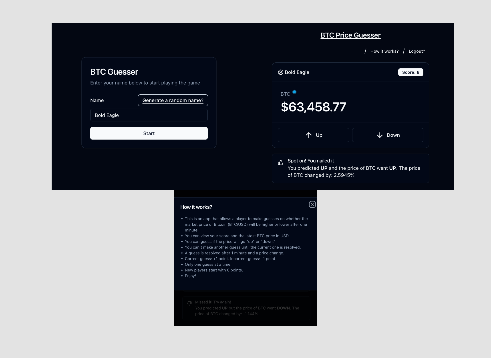

# BTC Price Guesser

A web app that allows users to make guesses on whether the market price of Bitcoin (BTC/USD) will be higher or lower after one minute.

It uses the [Binance web sockets stream API](https://developers.binance.com/docs/binance-spot-api-docs/web-socket-streams) to get the latest BTC <> USD price and lets you predict if the price of BTC may go high or low in the next 1 minute.

[🚀 Live Demo](https://btc-price-guesser.stikercloudapps.xyz/)

The project uses the following stack:

| Name                                                                                               | Description       |
| -------------------------------------------------------------------------------------------------- | ----------------- |
| [Remix](https://remix.run/)                                                                        | Frontend          |
| [shadcn/ui](https://ui.shadcn.com/)                                                                | Component library |
| [Prisma](https://www.prisma.io/)                                                                   | ORM               |
| [PostgreSQL](https://www.postgresql.org/)                                                          | Primary Database  |
| [Coolify](https://coolify.io/) & [Cloudflare tunnels](https://www.cloudflare.com/products/tunnel/) | Hosting           |

## Getting started

### Pre-requisites:

- Install [nodejs via nvm](https://nodejs.org/en/download/package-manager)
- Install [docker](https://www.docker.com/)

### Setup Backend

- `docker compose up` to start the necessary backend services (e.g.: PostgreSQL)
- `cp .env.template .env` and make sure to configure the `.env` according to your needs

### Install dependencies & migrations

- `nvm use` so it picks the correct node.js version from `.nvmrc`
- `npm install` to install dependencies
- `npm run dev:prisma:migrate` to run database migrations
- `npm run dev:prisma:generate` to generate prisma model types

### Run Frontend

- `npm run dev`
- Open the url (default: http://localhost:5173) in your browser

### Deployment

- Deployment is currently done manually from the [coolify](https://coolify.io/) UI and [Cloudflare tunnels](https://developers.cloudflare.com/cloudflare-one/connections/connect-networks/)

## TODO

- [ ] Add GH actions to run linting and build
- [ ] Logout if session expires (on window-refocus)
- [ ] Unit tests
- [ ] Error handling / server 400 and 500
